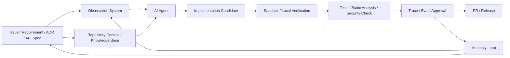

# 🛰️ AI-Assisted Development Models

In AI-assisted development, the bottleneck is no longer the speed of code generation.

The real challenge is ensuring that generated code follows the right requirements, constraints, boundaries, and completion criteria.

This document organizes three models for AI-assisted development:

* **Stargazer Model**
* **Observatory Model**
* **Orbital Model**

### Core Thesis

Code generation is no longer the center of gravity in software development.

When AI can generate code faster than humans can review it, the real engineering problem drifts elsewhere. It moves toward observation, constraint, boundary, verification, and recovery.

An AI-assisted workflow without an observation system is not progress. It is uncertainty moving at machine speed.

The value of the developer is no longer measured by how quickly code can be written, but by how clearly the work can be framed before AI begins to act.

A developer must draw the frame: what the system should observe, what the AI must preserve, what it may reshape, what it must never break, and how the result will be judged.

In the AI era, engineering begins before implementation.

It begins by drawing the observation system.

### Observation System

An observation system is a set of requirements, constraints, boundaries, completion criteria, regression signals, and verification procedures that make AI-assisted work reviewable, controllable, and recoverable.

Before AI begins to touch code, the developer must make the work observable: what should happen, what must be preserved, what may be changed, what must never break, and how the result will be judged.

> ⚠️ Without this frame, AI can still generate code. But the work becomes harder to review, harder to trust, and harder to recover when it drifts.

In this document, the observation system is the line that separates controlled AI-assisted development from simple code generation.

### Models

#### Stargazer Model

The Stargazer Model begins with discovery.

AI generates the first visible shape before the observation system is fully drawn. The developer then inspects the result, detects mismatches, and corrects the direction through repeated prompts or direct edits.

> ⚡ Its strength is speed. This model works well when speed matters more than structural certainty: prototypes, throwaway experiments, early UI sketches, and idea validation.

> ⚠️ Its risk appears when the generated result hardens before the structure is understood. Requirements are discovered after implementation, boundaries are drawn after changes have already spread, and regression risks surface late.

> “I have looked further into space than ever human being did before me.”\
> — William Herschel

#### Observatory Model

The Observatory Model begins with framing.

Before AI begins to generate or reshape code, the developer draws the observation system: requirements, constraints, boundaries, completion criteria, regression signals, and verification procedures.

In this model, AI does not start from an empty sky. It works inside a visible frame. The developer defines what must be preserved, what may be changed, what must never break, and how the result will be judged.

The Observatory Model turns AI-assisted development from code generation into controlled engineering work.

> 🧭 Its strength is control. This model works well for production code, team development, API contracts, data consistency, permission logic, security-sensitive flows, and long-term maintainability.

> ⚠️ Its cost is preparation. The observation system must be drawn before implementation begins, and a poorly drawn frame can still guide AI in the wrong direction.

> “Measure what is measurable, and make measurable what is not so.”\
> — Galileo Galilei

#### Orbital Model

The Orbital Model begins with a center.

Instead of drawing the full observation system in advance, the developer fixes the core requirement, regression boundary, and no-crossing zone first. AI is then allowed to explore implementation candidates within that orbit.

In this model, AI does not move freely, but it does not stand still either. It searches, reshapes, and compares possible implementations while remaining bound to the center that must not be lost.

> ⚡ Its strength is controlled exploration. This model works well for UI flows, dashboards, report screens, documentation structure, internal tools, library adoption, and situations where multiple implementation candidates need to be compared quickly.

> ⚠️ Its risk appears when the center is weak. If the core requirement, regression boundary, or no-crossing zone is unclear, exploration can drift back into the Stargazer Model.

### Feedback Loop

#### Anomaly Loop

The Anomaly Loop begins with deviation.

Unlike the three models above, the Anomaly Loop begins after deviation appears and guides the response to that anomaly.

An anomaly may be a local implementation defect, but it may also reveal that the observation system itself is incomplete, distorted, or drawn from the wrong coordinates.

The response depends on what the anomaly reveals.

**Mending**

Mending is used when the observation system remains valid and the anomaly is limited to a local implementation defect.

In this case, the existing requirements, constraints, boundaries, completion criteria, and verification procedures can stay in place. The broken part can be repaired inside the current frame.

Mending handles the crack without redrawing the frame.

**Diagnosis**

Diagnosis is used when the cause of an anomaly is not yet clear.

Instead of asking AI to patch the visible failure immediately, the developer asks AI to inspect the anomaly: what changed, which requirement may have been violated, which boundary may have drifted, and which recovery paths are available.

In this mode, AI expands the diagnostic field. The developer chooses the path.

Diagnosis is useful when the anomaly may come from multiple sources: implementation logic, missing context, unclear requirements, weak constraints, incomplete tests, or an unexpected interaction with existing code.

**Recalibration**

Recalibration is used when the anomaly reveals that the observation system itself was drawn from the wrong coordinates.

The issue is not limited to a broken implementation. A requirement may be missing, a constraint may be too weak, a boundary may be unclear, or the completion criteria may not reflect the actual work.

In this case, the developer adjusts the frame before asking AI to continue: requirements, constraints, boundaries, completion criteria, regression signals, and verification procedures are refined into sharper coordinates.

Recalibration prevents AI from moving faster along the wrong path.

**Return to Origin**

Return to Origin is used when the current attempt has moved too far along a distorted frame.

At this point, continuing to patch the result can make the work harder to trust. The developer reverts the broken attempt, updates the observation system, and asks AI to run the operation again within the corrected frame.

This response is useful when the anomaly is not isolated: the wrong requirement has shaped multiple changes, the boundary has already been crossed, or the generated result has spread regression risk across the codebase.

Return to Origin brings the work back to the starting point, now guided by better coordinates.

> “Nothing is lost, nothing is created, everything is transformed.”\
> — Antoine Lavoisier

### Model Relationship

The three models describe how AI-assisted work begins.

The Stargazer Model begins with discovery.\
The Observatory Model begins with framing.\
The Orbital Model begins with a center.

The Anomaly Loop begins later, when deviation appears.

Together, these concepts form a practical map for AI-assisted development: discover quickly, frame carefully, explore within a center, and transform anomalies into a sharper observation system.

These models form the underlying elements of a larger way to reason about AI-assisted development.

The following diagram maps these concepts onto a practical AI-assisted workflow.

> “The mathematics clearly called for a set of underlying elementary objects.”\
> Those objects were quarks.\
> — Murray Gell-Mann

### Usage Strategy

Use the Stargazer Model when discovery matters more than certainty.

It is useful for prototypes, throwaway experiments, early UI sketches, and idea validation. The goal is to reveal the first visible shape quickly, then inspect whether the direction is worth keeping.

Use the Observatory Model when control matters more than speed.

It is suitable for production code, team development, API contracts, data consistency, permission logic, security-sensitive flows, and long-term maintainability. The work begins by drawing the observation system before AI begins to act.

Use the Orbital Model when exploration is needed, but the center must not be lost.

It works well when multiple implementation candidates need to be compared quickly, as long as the core requirement, regression boundary, and no-crossing zone remain fixed.

Use the Anomaly Loop when the result begins to drift.

An anomaly may be more than a simple failure. It may require mending, diagnosis, recalibration, or a return to origin.

### Closing Thesis

AI-assisted development does not end with faster code generation.

Its real value appears when the developer can draw the frame, guide the exploration, observe deviation, and transform what was learned into a sharper system.

The future of development belongs not to those who ask AI to write more code, but to those who can make the work observable, controllable, and recoverable.

Beyond code generation, engineering begins with observation.

> “In the fields of observation, chance favors only the prepared mind.”\
> — Louis Pasteur
