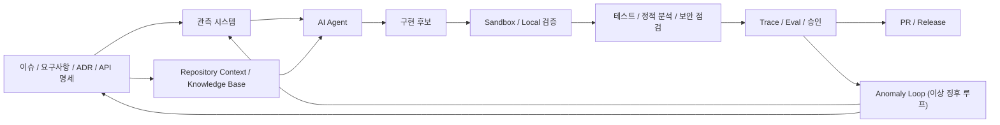

# 🛰️ AI-Assisted Development Models (KR)

## 현재 좌표계

* AI-assisted development에서 병목은 더 이상 코드 생성 단계에 있지 않다.
* 핵심 문제는 AI가 움직이기 전과 후의 작업을 어떻게 관측 가능하고, 검증 가능하며, 복구 가능한 상태로 만들 것인가에 있다.
* 이 모델들은 즉흥적인 프롬프팅을 하나의 운영체계로 바꾸기 위한 실무적 지도다.

이 문서는 AI 활용 작업을 관측 가능하고, 통제 가능하며, 복구 가능한 상태로 만들기 위한 세 가지 개발 모델, 하나의 피드백 루프, 그리고 공유 어휘를 정리한다.

세 가지 개발 모델은 다음과 같다.

* **Stargazer Model (탐색형 관측 모델)**
* **Observatory Model (관측소 모델)**
* **Orbital Model (궤도 모델)**

## 핵심 명제

코드 생성은 소프트웨어 개발의 중심 중력에서 밀려났다.

AI가 인간의 검토 속도를 넘어 코드를 생성할 수 있게 되면, 진짜 엔지니어링 문제는 다른 곳으로 이동한다. 문제의 중심은 관측, 제약, 경계, 검증, 복구로 옮겨간다.

관측 시스템이 없는 AI 활용 작업 흐름은 진보로 부르기 어렵다. 기계의 속도로 움직이는 불확실성일 뿐이다.

이제 개발자의 가치는 코드를 얼마나 빨리 작성하느냐보다, AI가 움직이기 전에 작업을 얼마나 선명하게 프레이밍할 수 있느냐로 드러난다.

개발자는 프레임을 그려야 한다. 시스템이 무엇을 관측해야 하는지, AI가 무엇을 보존해야 하는지, 무엇을 다시 빚어도 되는지, 무엇을 절대 깨뜨리면 안 되는지, 그리고 결과를 어떻게 판단할 것인지 정해야 한다.

AI 시대의 엔지니어링은 구현 전에, 관측 시스템을 그리는 데서 시작된다.

## 관측 시스템

관측 시스템은 AI 활용 작업을 검토 가능하고, 통제 가능하며, 복구 가능한 상태로 만드는 요구사항, 제약, 경계, 완료 기준, 회귀 신호, 검증 절차의 집합이다.

AI가 코드를 건드리기 전에, 개발자는 작업을 관측 가능한 상태로 만들어야 한다. 무엇이 실행되어야 하는지, 무엇이 보존되어야 하는지, 무엇이 바뀌어도 되는지, 무엇이 절대 깨지면 안 되는지, 그리고 결과를 어떻게 판단할 것인지가 먼저 드러나야 한다.

> ⚠️ 이 프레임이 없더라도 AI는 코드를 생성할 수 있다. 하지만 그 작업은 검토하기 어려워지고, 신뢰하기 어려워지며, 방향이 어긋났을 때 복구하기 더 어려워진다.

이 문서에서 관측 시스템은 통제된 AI-assisted development와 단순한 코드 생성을 구분하는 기준점이다.

## 개발 모델

### Stargazer Model (탐색형 관측 모델)

Stargazer Model은 발견에서 시작한다.

관측 시스템이 완전히 그려지기 전에 AI가 먼저 눈에 보이는 첫 형태를 생성한다. 개발자는 그 결과를 살피고, 어긋난 지점을 감지한 뒤, 반복 프롬프트나 직접 수정을 통해 방향을 교정한다.

> ⚡ 이 모델의 강점은 속도다. 구조적 확실성보다 속도가 더 중요한 상황에서 잘 맞는다. 프로토타입, 버려도 되는 실험, 초기 UI 스케치, 아이디어 검증 같은 작업이 여기에 해당한다.

> ⚠️ 이 모델의 위험은 생성된 결과가 구조를 이해하기 전에 굳어질 때 나타난다. 요구사항은 구현 뒤에 발견되고, 경계는 변경이 이미 퍼진 뒤에 그려지며, 회귀 위험은 늦게 드러난다.

> “나는 나보다 앞선 어떤 인간보다 더 먼 우주를 들여다보았다.”\
> — William Herschel

### Observatory Model (관측소 모델)

Observatory Model은 프레이밍에서 시작한다.

AI가 코드를 생성하거나 다시 빚기 전에, 개발자는 관측 시스템을 먼저 그린다. 요구사항, 제약, 경계, 완료 기준, 회귀 신호, 검증 절차가 여기에 포함된다.

이 모델에서 AI는 보이는 프레임 안에서 출발한다. 개발자는 무엇이 보존되어야 하는지, 무엇이 바뀌어도 되는지, 무엇이 절대 깨지면 안 되는지, 그리고 결과를 어떻게 판단할 것인지 정의한다.

Observatory Model은 단순 코드 생성을 통제된 엔지니어링 작업으로 끌어올린다.

> 🧭 이 모델의 강점은 통제력이다. 프로덕션 코드, 팀 개발, API 계약, 데이터 정합성, 권한 로직, 보안에 민감한 흐름, 장기 유지보수성에 잘 맞는다.

> ⚠️ 이 모델의 비용은 준비다. 구현이 시작되기 전에 관측 시스템이 먼저 그려져야 하며, 잘못 그려진 프레임은 여전히 AI를 잘못된 방향으로 이끌 수 있다.

> “측정할 수 있는 것은 측정하고, 아직 측정할 수 없는 것은 측정 가능하게 만들라.”\
> — Galileo Galilei

### Orbital Model (궤도 모델)

Orbital Model은 중심에서 시작한다.

전체 관측 시스템을 처음부터 모두 그리지 않고, 개발자는 먼저 핵심 요구사항, 회귀 경계, 넘지 말아야 할 구역을 고정한다. 그다음 AI는 그 궤도 안에서 구현 후보들을 탐색할 수 있다.

이 모델에서 AI는 반드시 잃어버리면 안 되는 중심에 묶인 채 움직인다. 멈춰 서지 않고, 가능한 구현을 찾고, 다시 빚고, 비교한다.

> ⚡ 이 모델의 강점은 통제된 탐색이다. UI 흐름, 대시보드, 리포트 화면, 문서 구조, 내부 도구, 라이브러리 도입, 여러 구현 후보를 빠르게 비교해야 하는 상황에 잘 맞는다.

> ⚠️ 이 모델의 위험은 중심이 약할 때 나타난다. 핵심 요구사항, 회귀 경계, 넘지 말아야 할 구역이 불명확하면 탐색은 다시 Stargazer Model로 흘러갈 수 있다.

> “내게 설 자리를 주면, 지구를 움직이겠다.”\
> — Archimedes

## 피드백 루프

### Anomaly Loop (이상 징후 루프)

Anomaly Loop는 이탈에서 시작한다.

이 루프는 이탈이 나타난 뒤의 대응을 다룬다.

이상 징후는 국소적인 구현 결함일 수 있지만, 관측 시스템 자체가 불완전하거나, 왜곡되어 있거나, 애초에 잘못된 좌표에서 그려졌음을 드러낼 수도 있다.

대응은 이상 징후가 무엇을 드러냈는지에 따라 달라진다.

**Mending (수선)**

Mending은 관측 시스템이 여전히 유효하고, 이상 징후가 국소적인 구현 결함에 머무를 때 사용된다.

이 경우 기존 요구사항, 제약, 경계, 완료 기준, 검증 절차는 그대로 유지될 수 있다. 깨진 부분은 현재 프레임 안에서 수리하면 된다.

Mending은 프레임을 다시 그리지 않고 균열만 다룬다.

**Diagnosis (진단)**

Diagnosis는 이상 징후의 원인이 아직 명확하지 않을 때 사용된다.

보이는 실패를 AI에게 즉시 패치하라고 요청하는 대신, 개발자는 AI에게 이상 징후를 조사하게 한다. 무엇이 바뀌었는지, 어떤 요구사항이 위반되었을 수 있는지, 어떤 경계가 밀려났는지, 어떤 복구 경로가 가능한지 살핀다.

이 모드에서 AI는 진단 영역을 넓힌다. 경로를 선택하는 것은 개발자다.

Diagnosis는 이상 징후가 여러 원천에서 나왔을 수 있을 때 유용하다. 구현 로직, 누락된 맥락, 불명확한 요구사항, 약한 제약, 불완전한 테스트, 기존 코드와의 예상 밖 상호작용이 모두 원인이 될 수 있다.

**Recalibration (재보정)**

Recalibration은 이상 징후가 관측 시스템 자체가 잘못된 좌표에서 그려졌음을 드러낼 때 사용된다.

문제는 깨진 구현 하나에 머무르지 않는다. 요구사항이 빠졌을 수도 있고, 제약이 너무 약했을 수도 있으며, 경계가 불명확했을 수도 있고, 완료 기준이 실제 작업을 반영하지 못했을 수도 있다.

이 경우 개발자는 AI에게 계속 진행하라고 요청하기 전에 프레임을 조정한다. 요구사항, 제약, 경계, 완료 기준, 회귀 신호, 검증 절차는 더 선명한 좌표로 다시 정제된다.

Recalibration은 AI가 잘못된 경로를 더 빠르게 달려 나가는 일을 막는다.

**Return to Origin (원점 복귀)**

Return to Origin은 현재 시도가 왜곡된 프레임을 따라 이미 너무 멀리 갔을 때 사용된다.

이 지점에서 결과를 계속 패치하면 작업의 신뢰도는 더 낮아질 수 있다. 개발자는 기록된 원점으로 돌아가 관측 시스템을 다시 보정하고, 더 선명한 좌표로 작업을 다시 실행한다.

원점은 여러 기록된 좌표로 구성될 수 있다. 저장된 지시, prompt artifact, 요구사항 메모, 설계 결정, operation log, 시스템 스냅샷, 또는 다른 안정된 baseline이 원점이 될 수 있다.

Return to Origin은 작업이 시작된 좌표로 복귀하는 일이다.

실패한 시도는 관측 증거로 보존된다. 어떤 제약이 빠졌는지, 어떤 경계가 실패했는지, 어떤 가정이 불안정해졌는지, 어떤 지시가 작업을 의도한 경로에서 끌어냈는지가 남는다.

다음 시도는 다시 원점에서 시작된다. 다만 같은 이해로 시작하지는 않는다.

원점은 같다.

관측자가 달라졌다.

프롬프트는 더 선명해진다.

프레임은 더 정밀해진다.

루프는 기억을 앞으로 운반한다.

> “오류는 기술에 있는 것이 아니라 기술자에게 있다.”\
> — Isaac Newton, _Principia_

## 모델 간의 관계

세 가지 모델은 AI 활용 작업이 어떻게 시작되는지를 설명한다.

Stargazer Model (탐색형 관측 모델)은 발견에서 시작한다.\
Observatory Model (관측소 모델)은 프레이밍에서 시작한다.\
Orbital Model (궤도 모델)은 중심에서 시작한다.

Stargazer Model (탐색형 관측 모델)은 때로 우아한 쓰레기를 만들어낼 수 있다. 매끄럽고, 일관되어 보이고, 구조적으로 매력적이지만, 약하거나 빠진 제약 위에 세워진 결과물이다.

그 결과를 완성물로 받아들이지 않고 버려도 되는 신호로 다룬다면, 그것은 여전히 비어 있던 중심의 형태를 드러낼 수 있다.

그렇게 발견된 중심은 Orbital Model (궤도 모델)의 출발점이 될 수 있다.

Anomaly Loop (이상 징후 루프)는 그보다 나중에, 이탈이 나타났을 때 시작된다.

이 개념들은 함께 AI-assisted development를 위한 실무적 지도를 이룬다. 빠르게 발견하고, 신중하게 프레이밍하고, 중심 안에서 탐색하며, 이상 징후를 더 선명한 관측 시스템으로 바꾼다.

이 모델들은 AI-assisted development를 사고하기 위한 더 큰 운영 방식의 기초 요소들이다.

다음 다이어그램은 이 개념들을 실무적인 AI 활용 작업 흐름 위에 배치한다.

> “정보는 정보일 뿐, 물질이나 에너지가 아니다.”\
> — Norbert Wiener

## 모델 선택 매트릭스

| 모델                          | 진입점    | 운영 맥락                                                  | 주요 레버리지       | 시스템 리스크                                |
| --------------------------- | ------ | ------------------------------------------------------ | ------------- | -------------------------------------- |
| Stargazer Model (탐색형 관측 모델) | 발견     | 목표가 불명확하고, 구조적 확실성보다 탐색 속도가 우선되는 상황.                   | 고속 발견         | 제약이 매핑되기 전에 결과물이 레거시로 굳어진다.            |
| Observatory Model (관측소 모델)  | 프레이밍   | 영향 범위가 프로덕션 코드, 팀 작업 흐름, 데이터 정합성, 아키텍처 유지보수까지 이어지는 상황. | 전체 흐름의 감사 가능성 | 왜곡된 프레임이 AI 작업 루프 전체를 체계적으로 잘못 이끈다.    |
| Orbital Model (궤도 모델)       | 고정된 중심 | 타협할 수 없는 요구사항을 고정한 채 여러 실행 경로를 시험해야 하는 상황.             | 구심적 탐색        | 중심이 약해지면 작업 흐름은 다시 Stargazer 상태로 밀려난다. |
| Anomaly Loop (이상 징후 루프)     | 이탈     | 결과물이 방향을 벗어났거나, 검증에 실패했거나, 검증 시스템의 경계 사례를 드러낸 상황.      | 빠른 재보정        | 시스템적 결함을 국소 결함으로 취급하면 아키텍처의 편향이 숨겨진다.  |

## 사용 전략

확실성보다 발견이 더 중요할 때 Stargazer Model (탐색형 관측 모델)을 사용한다.

이 모델은 프로토타입, 버려도 되는 실험, 초기 UI 스케치, 아이디어 검증에 유용하다. 목표는 눈에 보이는 첫 형태를 빠르게 드러낸 뒤, 그 방향을 유지할 가치가 있는지 살피는 것이다.

속도보다 통제가 더 중요할 때 Observatory Model (관측소 모델)을 사용한다.

이 모델은 프로덕션 코드, 팀 개발, API 계약, 데이터 정합성, 권한 로직, 보안에 민감한 흐름, 장기 유지보수성에 적합하다. 작업은 AI가 움직이기 전에 관측 시스템을 먼저 그리는 데서 시작된다.

탐색은 필요하지만 중심을 잃어서는 안 될 때 Orbital Model (궤도 모델)을 사용한다.

핵심 요구사항, 회귀 경계, 넘지 말아야 할 구역이 고정되어 있는 한, 여러 구현 후보를 빠르게 비교해야 하는 상황에서 잘 맞는다.

결과가 방향을 벗어나기 시작할 때 Anomaly Loop (이상 징후 루프)를 사용한다.

이상 징후는 단순한 실패 이상일 수 있다. 그것은 Mending (수선), Diagnosis (진단), Recalibration (재보정), Return to Origin (원점 복귀)을 요구할 수 있다.

## 결론 (Closing Thesis)

AI-assisted development는 더 빠른 코드 생성에서 끝나지 않는다.

진짜 가치는 개발자가 프레임을 그리고, 탐색을 이끌고, 이탈을 관측하며, 그 과정에서 배운 것을 더 선명한 시스템으로 바꿀 수 있을 때 드러난다.

개발의 미래는 작업을 관측 가능하고, 통제 가능하며, 복구 가능한 상태로 만들 수 있는 사람 쪽으로 이동한다.

코드 생성 너머에서, 엔지니어링은 관측으로 시작된다.

> “관측의 영역에서, 우연은 준비된 마음에게만 호의를 베푼다.”\
> — Louis Pasteur

## 이웃 좌표계

* [Ride, Don’t Race (KR)](../perspective/ride-dont-race-kr.md)를 읽고, AI와 경주하는 대신 AI와 함께 일하는 핵심 관점으로 돌아갑니다.
* [Codex as an Execution Layer (KR)](codex-as-an-execution-layer-kr.md)를 읽고, 관측, 요구사항, 제약, 경계, 완료 기준이 선언된 뒤 Codex가 하위 실행 계층에 놓이는 방식이 구체적인 도구 선택에 어떻게 적용되는지 살펴봅니다.
* [The Paradox of the Human Auditor (KR)](the-paradox-of-the-human-auditor-kr.md)를 읽고, 구조화된 검증 없이는 인간의 검토만으로도 충분하지 않은 이유를 살펴봅니다.
* [The Burden of Plain Speech (KR)](the-burden-of-plain-speech-kr.md)를 읽고, 명확한 지시가 AI-assisted work 안에서 어떻게 재사용 가능한 artifact가 되는지 탐구합니다.
* [The Asymmetry of Friction (KR)](case-the-asymmetry-of-friction-kr.md)를 읽고, AI의 기본 응답 기준과 사용자의 working criteria가 어긋날 때 교정 비용이 감정 비용과 운영 비용으로 전환되는 과정을 살펴봅니다.
* [Why We Study (KR)](../perspective/why-we-study-kr.md)를 읽고, AI가 생성한 결과물을 판단하기 위해 필요한 문해력과 이 운영 모델을 연결합니다.
* [The Engine: That Which No Single Name Can Hold (KR)](../perspective/the-engine-that-which-no-single-name-can-hold-kr.md)를 읽고, 하나의 직무명이나 기술 스택으로 축소되지 않는 작업 흐름이 AI 활용 개발 모델 안에서 어떻게 확장되는지 확인합니다.

***

> **Coordinate Provenance**\
> 이 좌표는 Riu Salze의 엔지니어링 아카이브 _Cosmic Horizon_ 일부입니다. 이 문서의 고유한 명명, 메타포, 용어, 구조, 경계 모델, 기록된 패턴, 또는 블루프린트를 인용·요약·개작·참조할 경우 보이는 형태로 출처를 표시해 주세요. [How to cite](../cosmic-horizon-start-here-kr.md)를 확인해 주세요.
