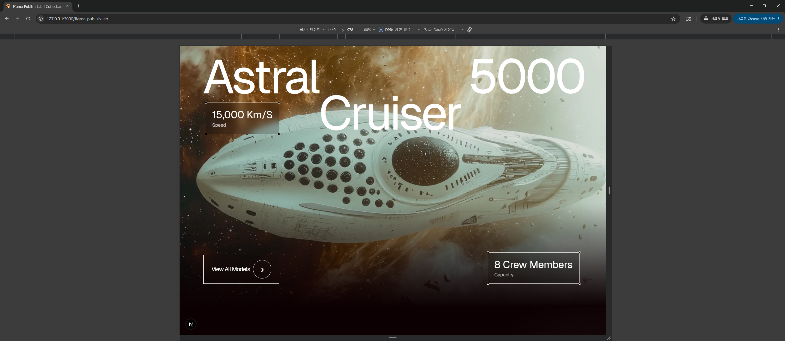
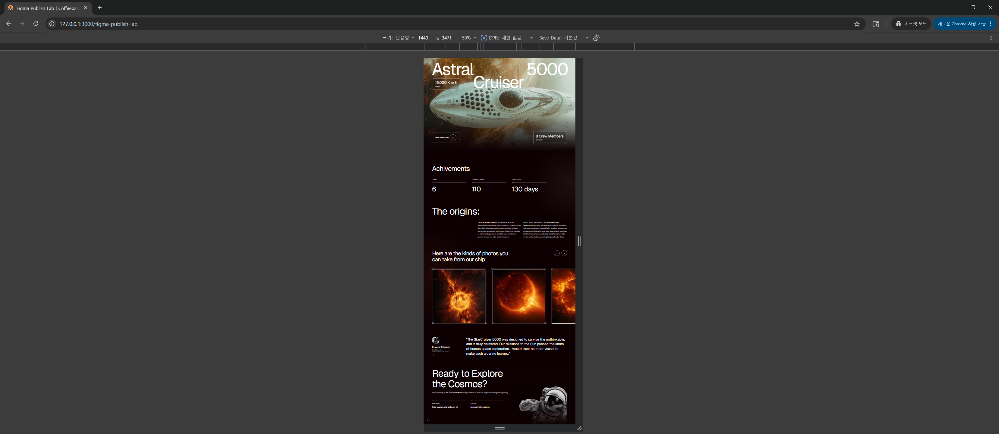
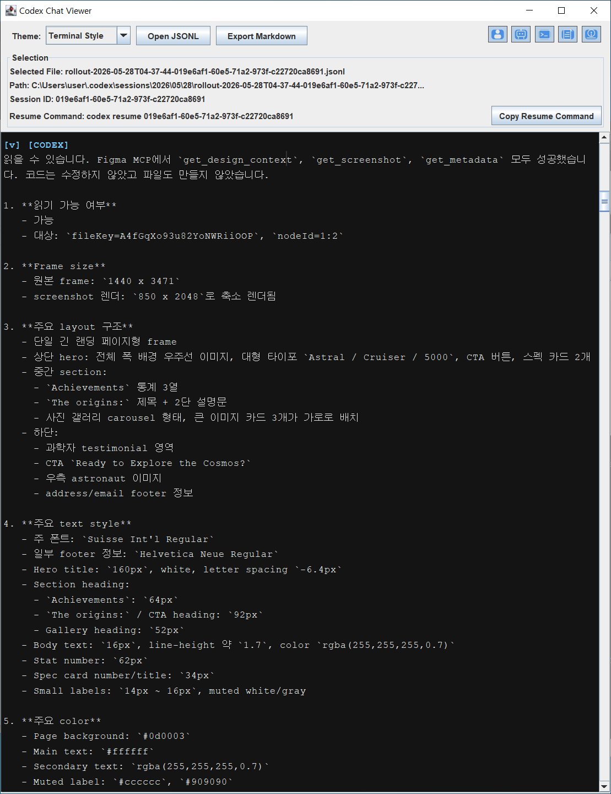

# 🛸 \[case] Why My Ship Is Ivory

> Navigation log
>
> **Between the shipyard and the engine room**

## Current Coordinates

* A Figma file no longer has to remain a visual reference sitting outside the development process.
* Figma MCP can expose screen structure, dimensions, typography, colors, and asset context to an AI coding agent.
* Codex can use that context to build an isolated UI draft without touching the core system of an existing project.
* The result is not a pixel-perfect final artifact. It is a first physical screen that gives designers and developers something concrete to inspect, discuss, and correct.
* Under these conditions, a significant part of static web publishing work can be pulled into the development flow.

## Between the Shipyard and the Engine Room

> “The art challenges the technology, and the technology inspires the art.”
>
> — John Lasseter

“Captain, a blueprint has arrived from the shipyard.”

“A Figma file?”

“Yes. Space Ships Prototype. Frame size: `1440 x 3471`.”

I looked at the spacecraft on the main screen.

A massive hull.\
A black background.\
White typography cutting through the dark.\
A carousel structure where sun images overflowed beyond the frame.\
At the bottom, an astronaut floated beside the CTA.

The screen carried more than an image.

Dimensions and coordinates.\
Typographic rules.\
Color values and asset positions.\
Even the designer’s intention, extending beyond the visible frame.

The blueprint was already speaking.

On the old route, this blueprint would have left the shipyard and moved into the hands of an intermediate HTML/CSS implementer, a role that often sits between design and development in South Korean web production workflows.

The designer would draw the screen.\
The intermediate implementer would build the HTML/CSS skeleton.\
The developer would connect state and data on top of it.

For a long time, this process was treated as a safe division of labor.

This time, I opened a different route.

“Bridge Codex.”

“Booting Figma MCP. Extracting blueprint data.”

“Keep the core navigation system intact. Authentication, database, API, and existing screen flows remain at baseline.”

“Where should we build it?”

“Open an isolated experimental deck.”

I wrote down the coordinates.

```
/figma-publish-lab
```

This screen was a validation surface launched on an isolated experimental deck.

The purpose was to see whether Codex could turn Figma’s design context into a physical screen inside an existing project.

“Execute.”

A moment later, Codex began reporting back.

The Figma MCP calls to `get_design_context`, `get_screenshot`, and `get_metadata` all succeeded.\
Frame size, layout structure, type styles, colors, and asset information came through.\
Inside the existing project, Codex created an independent route, a CSS module, and public asset paths.

lint passed.\
`/figma-publish-lab` was bound.\
The response was `200 OK`.

I opened the browser and entered the coordinates of the isolated deck.

The ship was there.

Of course, it was not perfect.

The type did not align exactly with the original.\
Some boundaries and crops needed more work.\
There was no mobile responsive design in the source frame.\
The astronaut image was closer to a rough temporary crop, limited by Figma MCP usage constraints and the available reference.

Still, the screen was physically present in the browser.

The designer and the developer could now talk in front of a correctable draft.

The nature of the remaining work had changed.

Reduce this spacing.\
Align this baseline.\
Fix this image crop.\
Pull the CTA closer to the original layout.

The starting line had moved forward.

## Experiment Setup

This shipyard was built on Next.js.

The scope was restricted to validating a screen implementation path isolated from the existing system.

The change surface was bound to the `/figma-publish-lab` route, a CSS module, static assets, and mock data.\
The API, database, authentication, and existing service flow were preserved as the baseline.

The hypothesis was simple.

> Based on the design context interpreted through Figma MCP,\
> can Codex safely build an independent first-pass publishing route inside an existing project?

The implementation area was limited to `/figma-publish-lab`.

Only mock data was injected.\
The route and asset folders were separated so the experiment could be removed cleanly after validation.

This experiment was designed to validate a first-pass screen implementation process powered by Figma MCP and Codex inside an existing project.

## Evidence

### Original Figma Frame


### Codex Result: 1440px Hero



### Codex Result: Full Page



### Codex MCP Design Context Inspection Log



### Codex Execution Log

[Codex execution log](assets/why-my-ship-is-ivory/05_figma_mcp_codex_execution_log.md)

## What Codex Read

Codex observed the designer’s selected frame through the eyes of Figma MCP.

The selection contained:

* Frame size: `1440 x 3471`
* Layout hierarchy
* Typography styles
* Color and opacity data
* Asset placement context
* Required images and decorative elements
* A probable React or Next.js component structure

This point matters.

The input to this experiment went beyond a single screenshot. It included structural information from inside the Figma file.

Through the MCP interface, Codex read frame hierarchy, dimensions, typography, colors, and asset placement context.\
Based on that interpretation, it generated routes, components, CSS modules, and actual image assets inside an existing Next.js project.

What entered the coding process was not only the appearance of pixels.

It was Figma’s design context.

## What Codex Built

Codex added the following file structure to the existing project:

* `frontend/app/figma-publish-lab/page.js`
* `frontend/app/figma-publish-lab/spaceShips.module.css`
* `frontend/public/figma-publish-lab/space-ships/hero-spaceship.png`
* `frontend/public/figma-publish-lab/space-ships/gallery-sun-1.png`
* `frontend/public/figma-publish-lab/space-ships/gallery-sun-2.png`
* `frontend/public/figma-publish-lab/space-ships/gallery-sun-3.png`
* `frontend/public/figma-publish-lab/space-ships/scientist-avatar.png`
* `frontend/public/figma-publish-lab/space-ships/astronaut-crop.png`

The access coordinate was confirmed as:

```
http://127.0.0.1:3000/figma-publish-lab
```

The validation criteria were clear.

* `npm run lint` passed.
* `/figma-publish-lab` returned `200 OK`.
* `npm run build` failed because of a pre-existing `useSearchParams()` Suspense boundary issue in the existing `/login` page.
* That build failure was separated as an existing issue unrelated to the experimental route.

Codex preserved the boundary of the existing system.

To remove the experimental deck, the following two paths would be enough.

```
frontend/app/figma-publish-lab/
frontend/public/figma-publish-lab/
```

## What This Case Shows

This experiment is less a declaration that deletes an intermediate implementation role and more a record of how ownership over screen implementation can move.

The milestone is clear.

> By combining Figma MCP and Codex,\
> a developer can obtain first-pass screen implementation directly from a designer’s Figma blueprint,\
> without routing the work through a dedicated intermediate implementer.

The quality bar remains.

What moves is the starting point of review.

Once a structure-aware first draft is already running in the browser, the conversation between designer and developer changes.

The conversation shifts away from “Please mark this up from scratch” and toward sentences like these:

“Reduce this card margin by 8px.”\
“Bind the typography to the original guide.”\
“Rework the astronaut image mask gradient.”\
“Pull the CTA closer to the original position.”

The work moves from building the wall from zero to inspecting the cracks and offsets in a wall already standing.

The developer’s responsibility moves with it.

In this flow, the developer does not remain a downstream connector who simply receives a static screen from an intermediate implementer.

The developer moves into the position of inspecting and reconciling the difference between design context, AI-generated code, and product architecture.

## Cost Is Conserved

> “Rien ne se crée, rien ne se perd, tout se transforme.”
>
> — Antoine Lavoisier

Process cost follows the same law.

When AI enters the workflow, cost does not evaporate. It moves to different coordinates.

In the traditional process, cost accumulated in a linear waiting chain.

```
Designer
→ Intermediate Implementer
→ Developer
→ Revision Request
→ Re-publishing
→ Re-integration
```

In the orbit of this experiment, cost is redistributed like this:

```
Designer
→ Figma MCP
→ Codex
→ Developer Review
→ Designer Correction Loop
```

Some costs clearly shrink.

Handoff cost, communication waiting time, and repetitive static screen implementation cost all decrease.

But the gap is filled by Codex usage, the developer’s review energy, and a tighter correction loop with the designer.

Codex usage and developer attention are finite resources.

When a developer spends AI usage and judgment energy on screen implementation, less remains for other development work.

At this point, the intermediate implementation role may be preserved by being rearranged rather than erased.

The core of this change is not the disappearance of a single job title. It is the renegotiation of ownership over the intermediate process between design and development.

The person holding that intermediate role may move toward becoming an AI-assisted UI implementer.\
A web designer may expand their role from Figma into first-pass implementation.\
A developer may take responsibility for review and product integration earlier in the process.

The idea that “the machine works for free” misses the point.

The leverage is in starting the screen implementation faster,\
then validating the result immediately inside the actual project structure.

The advantage is the starting line moved forward.

## Why My Ship Is Ivory

My ship is not born only on pristine white design boards.

Nor is it locked inside the black, grease-stained terminal of the engine room.

My ship sails the waters between them.

In Figma, there is the surface created by the designer.\
In Codex, there is the cold execution power that translates that surface into code.\
In the developer, there is the responsibility to gather those fragments and prove them inside the product structure.

Ivory is the color of that boundary.

It is not pure design.\
It is not pure backend.\
It is not the repetition of static markup work.

It is not abstract praise for AI either.

It is the color of a developer holding the helm between the luminous surface of the screen and the rigid structure of the product, while using AI as a subordinate execution layer.

That is why my ship is ivory.

## Operating Sentence

A screen can be launched without a dedicated intermediate implementer.

This sentence does not lower the UI quality bar. It relocates the screen implementation process while keeping that bar in place.

If Figma MCP can deliver design context,\
if Codex can build the first physical screen,\
and if the developer can review it inside the engine room,\
then a significant part of static screen implementation can be absorbed into the development flow.

Now the screen is already there.

One question remains.

> Can the developer take responsibility for this result?

## Source

[Original Figma Community file](https://www.figma.com/design/A4fGqXo93u82YoNWRiiOOP/Space-Ships-|-Prototype--Community-?node-id=1-2\&m=dev\&t=mRkEGMLGUaxjFiSM-1)

## Related Coordinates

* Read [AI-Assisted Development Models](ai-assisted-development-models.md) to examine a model that places AI inside an observable and controllable development process, rather than treating it as a mere code vending machine.
* Read [Codex as an Execution Layer](codex-as-an-execution-layer.md) to examine how Codex can be constrained as a subordinate execution layer that follows declared goals instead of taking strategic control.
* Read [The Paradox of the Human Auditor](the-paradox-of-the-human-auditor.md) to examine how human review cost becomes a new bottleneck when AI can generate results faster than people can inspect them.
* Read [The Burden of Plain Speech](the-burden-of-plain-speech.md) to examine why clear boundary-setting language matters when working with AI agents prone to over-interpretation and drift.
* Read [FTL-Bound Agents](pattern-ftl-bound-agents/) to examine how reusable directive assets can compress and isolate the interpretation space of AI work.
* Visit [Codex Chat Viewer](https://github.com/RGJ-sw1123r/codex-chat-viewer) to see how Codex execution traces can be turned into human-readable navigation logs, making AI-assisted development reviewable as a record rather than a vague feeling.
